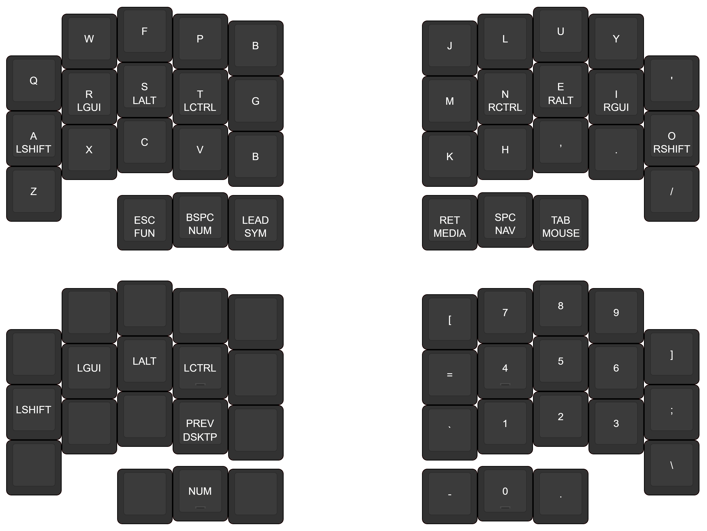

# ZMK Config

[ZMK](https://zmk.dev) config repo for 34-36 key split keyboards.

OS shortcuts for Windows:
- `Close Window`: <kbd>Alt</kbd><kbd>F4</kbdy>
- `Next Tab`: <kbd>Ctrl</kbd><kbd>Tab</kbd>
- `Previous Tab`: <kbd>Ctrl</kbd><kbd>Shift</kbd><kbd>Tab</kbd>
- `Close Tab`: <kbd>Ctrl</kbd><kbd>W</kbd>
- `Next Desktop`: <kbd>Ctrl</kbd><kbd>Gui</kbd><kbd>Right</kbd>
- `Prev Desktop`: <kbd>Ctrl</kbd><kbd>Gui</kbd><kbd>Left</kbd>
- `Next Window`: <kbd>Alt</kbd><kbd>Tab</kbd> (hold Alt while layer active)
- `Previous Window`: <kbd>Alt</kbd><kbd>Shift</kbd><kbd>Tab</kbd> (hold Alt while layer active)

